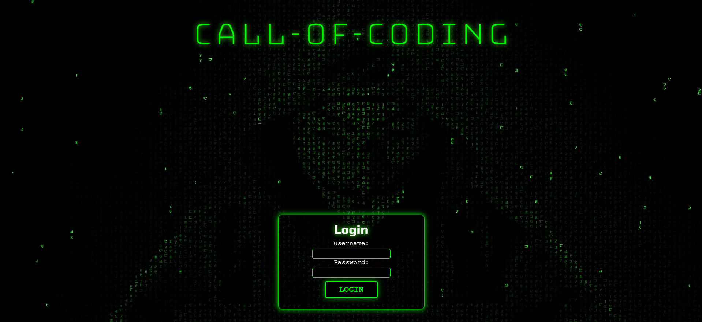
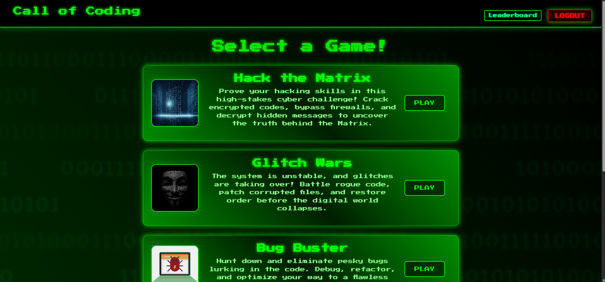
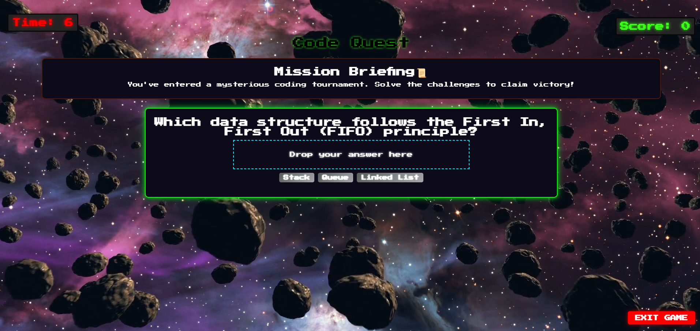

# Call Of Coding

## Table of Contents
- [Description](#description)
- [Screenshots](#screenshots)
- [Installation](#installation)
- [Usage](#usage)
- [Features](#features)
- [License](#license)
- [Contributing](#contributing)
- [Tests](#tests)
- [Credit](#credit)
- [Project Links](#project-links)
- [Questions](#questions)

## Description

Call of Coding is an interactive coding game where players must "code" their way out of different themed challenges. Each mission is designed to test and improve coding skills through problem-solving, debugging, and algorithmic thinking. The game offers a thrilling and immersive experience, making learning to code fun and engaging.

## Screenshots

Here are some previews of the webpage:

###  Login Page

### GameDashboard Page

### ActiveGame Page

### Leaderboard Page

## Installation

1. Clone the repository:

git clone https://github.com/alyssadailey/call-of-coding.git

2. Navigate into the project directory:

cd call-of-coding

3. Install dependencies:

npm install

4. Start the development server:

npm run dev

5. Open the application in your browser at http://localhost:5173/ (if using Vite).

## Usage

1. Sign up or log in to begin playing.

2. Choose a coding mission from the dashboard.

3. Solve coding challenges using the provided drag-and-drop interface.

4. Earn points for each question you get correct!

5. Track progress on the leaderboard and compete with friends!

## Features

-Engaging Missions: Solve puzzles related to debugging, encryption, and algorithm challenges.

-Themed Challenges: Escape a cursed codebase, hack encrypted data, fix a space station bug, and more.

-Leaderboard & Score Tracking: Compete with friends and track your best scores.

-Hints & Time Bonuses: Get help when stuck, but at the cost of some points.

-Dynamic User Interface: A hacker-themed UI for an immersive experience.

## License

This application is covered under the MIT license.

## Contributing

If you would like to contribute to my project please follow these steps!

1. Fork the repository on GitHub.
2. Clone your fork to your computer.
3. Create a new branch for your changes.
4. Make your changes and commit them using descriptive messages.
5. Push your branch and open a pull request!

## Tests

To test run:
 npm run test

## Credit

-Front-end Development: Alyssa Dailey and Ikran Mohammed

-Back-end Development: Stacy Vonderheide and Taija Martinez

-TA Diem assisted back-end to help get the leaderboard page functional

-The creators of Call of Coding met with tutors Alister, Chris and Justin throughout the coding process to assist in any coding related questions

-Used Vimeo to host all background videos

-Neon-blue bug background found on: https://www.vecteezy.com/

-All other background video found on: https://pixabay.com/

-SVG hacker green logo created on: https://www.svgrepo.com/

## Project Links

Repository: https://github.com/taijamartinez/call_of_coding 
Deployed Render Website: 

## Questions

Please reach us here with additional questions:

GitHub: https://github.com/taijamartinez  
Email: taijasmartinez@gmail.com 

Github: https://github.com/alyssadailey  
Email: alyssadailey28@gmail.com 

Github: https://github.com/ikranahmed  
Email: ikranahmed16@gmail.com 

Github: https://github.com/slvonderheide  
Email: slvonderheide@gmail.com 

We hope you enjoy Call of Coding! 🚀 Happy coding!
